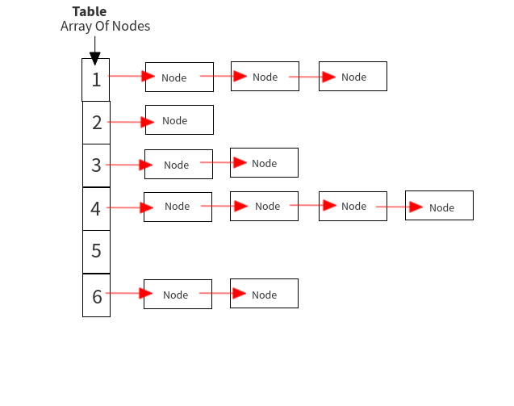

# Sets

## Introduction

### **What is a Set?**

- A Set in a type of Data Structure that stores values.
- A Set doesn't prioritize order.
- A Set won't allow duplicates.
- A Set may include elements of different types.
- A Set is mutable, meaning it's possible to change up the Set throughout its' existence.
- #### **Hashing**
  - A technique used within this Data Structure, in O(1) time, you're able to:
    - add
    - remove
    - test
- #### **Sparse List**
  - A Sparse List isn't guaranteed to be filled from left to right.
    - Very dependent on how the program is hashing the data and matching it with that particular index.
  - Very different than what is normally used, called a Dynamic Array.
- #### **Error/Conflict Handling**

  - Within a set, depending on how the set is hashing and storing the data, there could be an issue.
  - For Example:
    - Below is an image representing a Set.
    - We have indexes 1-6
    - Depending how the table is being hashed, depends on where the node is stored. Take a look at index 5. Let's say the table is being hashed where each node is a number and depending on what the first number starts with, is where the node with be stored.
      - Node = 11
      - That node will be stored under index 1
      - Node = 39
      - That node will be stored under index 3
  - Well how do we handle a situation once that index is already storing a value? Like if index 2 was already storing a node equal to 25 and then another node equaling 23 goes to be hashed, how can we handle that within a set?
  - There are 2 ways to handle this:

    - #### **Open Addressing**
      - Keep looking until an empty slot is found. Once an empty slot is found, insert/return the node depending on what you're trying to do.
      - Danger to open addressing is pretty obvious. The table may fill up too fast, the table might seem very unoriganized, and it will, eventually, start to lag a bit once the program starts to get bigger and bigger.
    - #### **Seperate Chaining**
      - So instead of moving to the next available key within the table, you create a list, and store that list under the appropriate index.
    - Understanding both, you recognize that both can slow down the program. Instead of the set hashing in O(1), it will start hashing in O(n)

    

### **Purpose for a Set in Real World Application**

- Sets are great to use when you require no duplicataions within the data structure.
- Sets are usually used to test if elements belongs within another Set or within a set of values, within O(1) time, at best.
- Sets are also used for mathematical operations/
  - union or intersection within two Sets.
- Some simple examples that a Set could be used:
  - Grocery Lists
  - Playlist of music
  - Each of these, you don't want duplicates and there is no real order to them outside of when they are added to the Set.
    <br><br>

## Using A Set in Python

A Set in Python is represented using curly braces or called the set() built-in Python method.

### **Operations used within a Python Set**

- .add()
  - This built-in Python function is used to add a data element to the set.
  - In Big O Notation, this operation takes O(1) time.
- .remove()
  - This built-in Python function is used to remove a data element that was added to the set.
  - In Big O Notation, this operation takes O(1) time.
- .len()
  - This built-in Python function is used to get the number of items within the set.
  - Also good to use to check if the set is empty or not.
  - In Big O Notation, this operation takes O(1) time.
- set1.intersection(set2)
  - This built-in Python function is used to see if the two sets have any common values
  - Could also write like:
    - set3 = set1 & set2
- set.union(set2)
  - This built-in Python function is used to combine the two sets, without adding any duplicates
  - Could also write like:
    - set3 = set1 | set2

<hr style='border-width: .5px; padding-top: 10px; padding-bottom: 5px;' />

## Coding Examples

### **Code Example of a Set in Python**

```python
# Python code to help demonstrate the basics of a set

# Creating an empty set
set1 = set()

# Adding an element to the set
set1.add('A')
set1.add('B')
set1.add('C')

# Print out the set
print('Set 1: ', set1) # Output: Set 1:  {'A', 'B', 'C'} <-- In no specific order

# Remove an element from the set
set1.remove('B')

# Print out the set
print('Set 1: ', set1)  # Output: Set 1:  {'A', 'C'} <-- In no specific order

# Get how many elements are within the set
numOfEl = len(set1)
print('Number of elements: ', numOfEl)  # Output: Number of elements:  2

# Create another set from a list
letterList = ['A', 'B', 'C', 'D', 'E', 'F', 'G']
set2 = set(letterList)

# Print out the 2nd set
print('Set 2: ', set2)  # Output: Set 2:  {'A', 'B', 'F', 'G', 'D', 'C', 'E'}

# See if there is any elements that intersects between set1 & set2
set3 = set1.intersection(set2)
print('Set 1 & Set 2 Intersected Elements: ', set3) # Output: Set 1 & Set 2 Intersected Elements:  {'A', 'C'}

# Unionize set1 & set2. There should be no duplicates
set3 = set1.union(set2)
print('Set 1 & Set 2 unionized: ', set3) # Output: Set 1 & Set 2 unionized:  {'A', 'B', 'C', 'D', 'G', 'F', 'E'}

```

### **Program Example of a Stack in Python**

```python
class My_Groceries():
    def __init__(self):
        self.grocery_list = set()

    def add_item(self, item):
        self.grocery_list.add(item)

    def remove_item(self, item):
        self.grocery_list.remove(item)

    def see_grocery_list(self):
        print(self.grocery_list)


groceries = My_Groceries()
groceries.add_item('Bananas')
groceries.add_item('Milk')
groceries.add_item('Sugar')
print('================')
groceries.see_grocery_list()  # Output: {'Bananas', 'Sugar', 'Milk'}
print('================')
groceries.remove_item('Sugar')
groceries.see_grocery_list()  # Output: {'Bananas', 'Milk'}
```

## Problem To Solve

For this problem, we will expand on the example program written above. The requirements for this problem include:

1. User should be able to see the next item to get, meaning to output only 1 item from the set.
1. User should be able to see the price of a certain item within the set.
1. User should be able to update an item within a set.
1. User should be able to see items that are the same from two different sets.
1. User should be able to combine 2 sets, just in case they have an old list they want to update to a newer list.

Be sure to leave relavent, concise comments throughout the code you write. It's good practice and will benefit you in the future when referencing back on old code or if someone wanted to look over your code.

Code to start out with (feel free to copy and paste into your own file):

```python
'''
    This is a program to create a grocery list.

    Although, a grocery list could prioritize order more than a Set does, I felt
    it is a good, easy application to implement as a Set. Once you solve this program,
    you'll find your understanding of a Set Data Strucutre clearer.

    Program written by Matthew Rapp.
'''

class My_Groceries():
    def __init__(self, setOfItems=None):
        # defaults to None
        if setOfItems is None:
            self.grocery_list = set()
        # pass in a set, the grocery list is now equal to the set
        else:
            self.grocery_list = setOfItems

    # this method allows the user to add an item to the set
    def add_item(self, item, price):
        # convert the item and price into a tuple
        storeItem = (item, price)
        # add the tuple to the set
        self.grocery_list.add(storeItem)

    # this method allows the user to remove an item from the set
    def remove_item(self, itemName):
        # copy the set to avoid RuntimeError
        gl = self.grocery_list.copy()
        for item in gl:
            # if item[0], the key/name, is equal to the paramater passed in, then remove it from the grocery list
            if item[0] == itemName:
                self.grocery_list.remove(item)

    ####################
    #### Problem #1 ####
    ####################
    # this method allows the user to see one item at a time within the set
    def get_next_item(self):
        pass
    ####################
    ####################
    ####################

    ####################
    #### Problem #2 ####
    ####################
    # this method allows the user to see the price of the item being passed in
    def get_price(self, itemName):
        pass
    ####################
    ####################
    ####################

    def _get_item_details(self, itemName):
        for item in self.grocery_list:
            # if the item name/key is equal to the itemName being passed it, bring out the item detials, then return
            if item[0] == itemName:
                print(item)
                return

    ####################
    #### Problem #3 ####
    ####################
    # this method allows the user to update an item within a set
    def update_item(self, oldItemName, updatedItemName, updatedPrice):
        pass
    ####################
    ####################
    ####################

    ####################
    #### Problem #4 ####
    ####################
    # this method allows the user to see the items that are the same within two sets
    def get_intersected_items(self, otherSet):
        pass
    ####################
    ####################
    ####################

    ####################
    #### Problem #5 ####
    ####################
    # this method allows the user to combine two sets, without duplicates and returns it as a single set
    def combine_items(self, otherSet):
        pass
    ####################
    ####################
    ####################

    # this method returns the grocery list, without printing the items

    def get_grocery_list(self):
        return self.grocery_list

    # this method prints the grocery list
    def see_grocery_list(self):
        print(self.grocery_list)


groceries = My_Groceries()
groceries.add_item('Bananas', 0.89)
groceries.add_item('Milk', 1.12)
groceries.add_item('Sugar', 2.44)
print('================')
# Output: {('Milk', 1.12), ('Bananas', 0.89), ('Sugar', 2.44)}
groceries.see_grocery_list()
print('================')
groceries.remove_item('Sugar')
groceries.see_grocery_list()  # Output: {('Milk', 1.12), ('Bananas', 0.89)}
print('================')
groceries.add_item('Cereal', 3.11)

####################
#### Problem #1 ####
####################
# Output: ('Cereal', 3.11) <-- Due to unorder of things, it could be any tuple printing out
groceries.get_next_item()
print('================')
####################
####################
####################
groceries.add_item('Cookies', 4.56)

####################
#### Problem #2 ####
####################
groceries.get_price('Cereal')  # Output: 3.11
print('================')
####################
####################
####################

####################
#### Problem #3 ####
####################
# Output: ('Fruit Loops', 4.21)
groceries.update_item('Cereal', 'Fruit Loops', 4.21)
print('================')
####################
####################
####################

newGroceries = My_Groceries()
newGroceries.add_item('Apples', 2.89)
newGroceries.add_item('Milk', 1.12)
newGroceries.add_item('Doritos', 4.99)

####################
#### Problem #4 ####
####################
# Convert class into set
ng = newGroceries.get_grocery_list()
groceries.get_intersected_items(ng)  # Output: {('Milk', 1.12)}
print('================')
####################
####################
####################

####################
#### Problem #5 ####
####################
allGroceries = groceries.combine_items(ng)
newestGroceryList = My_Groceries(allGroceries)
# Output: {('Cookies', 4.56), ('Fruit Loops', 4.21), ('Doritos', 4.99), ('Bananas', 0.89), ('Milk', 1.12), ('Apples', 2.89)}
newestGroceryList.see_grocery_list()
####################
####################
####################
```

You can check your answer with the solution here: [Solution](set-problem.py)

## Resources

- https://www.freecodecamp.org/news/what-is-hashing/#:~:text=Hashing%20means%20using%20some%20function,the%20item%20in%20the%20map.
- https://www.geeksforgeeks.org/hashing-set-3-open-addressing/
- https://learnpython.com/blog/python-set-operations-all-to-know/
