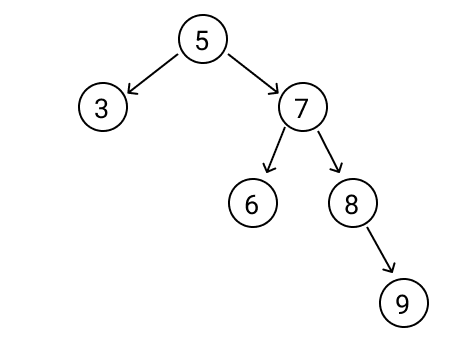

# Trees

## Introduction

## **What is a Tree?**

- A Tree is similar to Linked Lists, but can store multiple types of data within the Tree, unlike Linked Lists.
- There are three types of Trees:
  - **Binary Trees**
    - A Tree whose elements have, at most, 2 children
    - Each child is named 'Left' & 'Right' child
    - Contains a pointer to the left child
    - Contains a pointer to the right child
  - **Binary Search Trees**
    - Similar to a Binary Tree, but can have more than 2 children
    - The left side of the node has an index lesser than the index of the node itself
    - The right side of the node has an index greater than the index of the node itself
    - Both sides of the nodes, must be a Binary Search Tree as well.
  - **Balanced Binary Search Trees**
    - Similar to a Binary Search tree, but it's a BST but it automatically keeps its' height as small as possible.
    - The difference in height between any two subtrees isn't more different than 1 count.
    - Image of an unbalanced BST:
    - 
    - Image of a balanced BST:
    - 

### **Recursion**

- What is Recursion?
  - The process of the function calling itself directly or indirectly.
  - Very important to use within a BST program.
  - Think of recursion like a loop.
  - Simple program involving Recursion:

```python
houses = ["Eric's house", "Kenny's house", "Kyle's house", "Stan's house"]

# Each function call represents a visit to a house
def visit(houses):
    # if there is only 1 house
    if len(houses) == 1:
        house = houses[0]
        print("Visiting: ", house)

    # if there is more than 1 house
    else:
        # get the mid point within the list of houses
        mid = len(houses) // 2
        first_half = houses[:mid]
        second_half = houses[mid:]

        # recurve to multiple houses at once
        visit(first_half)
        visit(second_half)
```

- Why use recursion within a BST program?
  - Recursion is a useful tool to let the program solve pretty complex, big problems as a bunch of sub-problems.

## **Purpose for a Tree in Real World Application**

- BSTs could be used for rendering rendering objects in a 3D game.
- Programming language compilers.
- Maintaining sorted stream of data.
- Implement doubly ended priority queue.
- Sorting data.
  <br><br>

## **Using Trees in Python**

### **Operations using within a Python Tree**

- insert()
  - Inserting a value/node into the Tree.
  - In Big O Notation, this operation takes O(log n) time.
- remove()
  - Removing a value/node from the Tree.
  - In Big O Notation, this operation takes O(log n) time.
- exists()
  - Returns true/false whether the value/node is in the Tree.
  - In Big O Notation, this operation takes O(log n) time.
- height(rootNode)
  - Provide the root node as a parameter
  - Returns the maximum height of the Tree.
  - In Big O Notation, this operation takes O(log n) time.
- traverse_forward()
  - Returns the nodes/values of the tree from smallest to largest (left to right).
  - In Big O Notation, this operation takes O(log n) time.
- traversee_backward()
  - Returns the nodes/values of the tree from largest to smallest (right to left).
  - In Big O Notation, this operation takes O(log n) time.

<hr style='border-width: .5px; padding-top: 10px; padding-bottom: 5px;' />

## **Coding Examples**

```python
# Python code to help demonstrate the basics of a Tree

class BST:
    # implement the Binary Search Tree data structure.  The Node class below is an inner class to create a node/data object

    class Node:
        # each node of the BST will have data/data object and pointers to the left and right sub-tree

        def __init__(self, data=None):
            self.left = None
            self.right = None
            self.data = data

    def __init__(self):
        # initialize an empty BST
        self.root = None

    def insert(self, data):
        if self.root is None:
            # this means that the tree is empty, so just create a node within the tree
            self.root = BST.Node(data)
        else:
            # call a private function to implement the node into the right place within the tree. We use this function recursively.
            self._insert(data, self.root)

    def _insert(self, data, root):
        # this method will look for a place to insert a node/data object

        # if data is smaller than root
        if data < root.data:
            # if left side of tree is empty, insert a new node there
            if root.left is None:
                root.left = BST.Node(data)
            # if it's not empty, recurse to keep going down the tree
            else:
                self._insert(data, root.left)
        # if data is larger than root
        else:
           # if right side of tree is empty, insert a new node there
            if root.right is None:
                root.right = BST.Node(data)
            # if it's not empty, recurse to keep going down the tree
            else:
                self._insert(data, root.right)

    def exists(self, data):
        # this method will search for a node that contains data within the BST
        # by calling the private class mathod to recurse through the tree
        return self._exists(data, self.root)  # Start at the root

    def _exists(self, data, root):
        # this method will search for a node that contains data within the BST
        # if not found, it will return False or recurse again
        # if found, it will return True
        if data < root.data:
            if root.left is None:
                print('False')
                return False
            else:
                return self._exists(data, root.left)
        elif data > root.data:
            if root.right is None:
                print('False')
                return False
            else:
                return self._exists(data, root.right)
        else:
            print('True')
            return True

    def __iter__(self):
        # forward traversal
        # this method is called when a loop is performed
        yield from self._traverse_forward(self.root)

    def _traverse_forward(self, root):
        # print out data, from smallest to largest
        if root is not None:
            yield from self._traverse_forward(root.left)
            yield root.data
            yield from self._traverse_forward(root.right)


# create an tree instance
numbers = [3, 25, 1]
tree = BST()
for num in numbers:
    tree.insert(num)
for node in tree:
    print(node)  # Output: 1, 3, 25
tree.exists(22)  # Output: False
tree.exists(25)  # Output: True
```

## **Problem to Solve**

For this problem, we will expand on the Binary Search Tree, written above. The requirements for this problem include:

1. Implementing a \_get_min() method to return the smallest node value.
1. Implementing a \_get_max() method to return the largest node value.
1. Implementing a \_delete() method to delete a node within a tree
1. Implementing a \_height() method to return the height of the BST.
1. Implementing a \_traverse_backward() method to return the data within the tree from largest to smallest.

Be sure to leave relavent, concise comments throughout the code you write. It's good practice and will benefit you in the future when referencing back on old code or if someone wanted to look over your code.

Code to start out with (feel free to copy and paste into your own file):

```python
# Python code to help demonstrate the usage of a Tree and help improve your knowledge and skills of a Tree.

class BST:
    # implement the Binary Search Tree data structure.  The Node class below is an inner class to create a node/data object

    class Node:
        # each node of the BST will have data/data object and pointers to the left and right sub-tree

        def __init__(self, data=None):
            self.left = None
            self.right = None
            self.data = data

    def __init__(self):
        # initialize an empty BST
        self.root = None

    def insert(self, data):
        if self.root is None:
            # this means that the tree is empty, so just create a node within the tree
            self.root = BST.Node(data)
        else:
            # call a private function to implement the node into the right place within the tree. We use this function recursively.
            self._insert(data, self.root)

    def _insert(self, data, root):
        # this method will look for a place to insert a node/data object

        # if data is smaller than root
        if data < root.data:
            # if left side of tree is empty, insert a new node there
            if root.left is None:
                root.left = BST.Node(data)
            # if it's not empty, recurse to keep going down the tree
            else:
                self._insert(data, root.left)
        # if data is larger than root
        else:
           # if right side of tree is empty, insert a new node there
            if root.right is None:
                root.right = BST.Node(data)
            # if it's not empty, recurse to keep going down the tree
            else:
                self._insert(data, root.right)

    def exists(self, data):
        # this method will search for a node that contains data within the BST
        # by calling the private class mathod to recurse through the tree
        return self._exists(data, self.root)  # Start at the root

    def _exists(self, data, root):
        # this method will search for a node that contains data within the BST
        # if not found, it will return False or recurse again
        # if found, it will return True

        # if data is less than the root.data (left side)
        if data < root.data:
            # if the root has no Node on left side, return False
            if root.left is None:
                print('False')
                return False
            # otherwise, recurse with the left root
            else:
                return self._exists(data, root.left)
        # if data is greater than the root.data (right side)
        elif data > root.data:
            # if the root has no Node on right side, return False
            if root.right is None:
                print('False')
                return False
            # otherwise, recurse with the right root
            else:
                return self._exists(data, root.right)
        # if data is equal to the root.data
        else:
            print('True')
            return True

    def get_min(self):
        # this method will return the smallest node in the ree
        if self.root is None:
            return False
        return self._get_min(self.root)  # Start from the root

    ##################
    ### Problem #1 ###
    ##################

    def _get_min(self, root):
        # Your code goes here
        pass

    ##################
    ##################
    ##################

    def get_max(self):
        # this method will return the smallest node in the ree
        if self.root is None:
            return False
        return self._get_max(self.root)  # Start from the root

    ##################
    ### Problem #2 ###
    ##################

    def _get_max(self, root):
        # Your code goes here
        pass

    ##################
    ##################
    ##################

    def delete(self, data):
        # this method will delete the specificied data out of the tree
        if self.root is None:
            return False
        return self._delete(data, self.root)  # Start at the root

    ##################
    ### Problem #3 ###
    ##################

    def _delete(self, data, root):
        # Your code goes here
        pass

    ##################
    ##################
    ##################

    def height(self):
        # this method is called when wanting to know the tree's height
        if self.root is None:
            return False
        else:
            return self._height(self.root)  # Start at the root

    ##################
    ### Problem #4 ###
    ##################

    def _height(self, root):
        # Your code goes here
        pass

    ##################
    ##################
    ##################

    def __iter__(self):
        # forward traversal
        # this method is called when a loop is performed
        yield from self._traverse_forward(self.root)  # Start at the root

    def _traverse_forward(self, root):
        # print out data, from smallest to largest
        # if the root is not equal to None
        if root is not None:
            yield from self._traverse_forward(root.left)
            yield root.data
            yield from self._traverse_forward(root.right)

    def __reversed__(self):
        # backward traversal
        # this method is called when a loop is called on reversed() method
        yield from self._traverse_backward(self.root)  # Start at the root

    ##################
    ### Problem #5 ###
    ##################

    def _traverse_backward(self, root):
        # Your code goes here
        pass

    ##################
    ##################
    ##################


# create an tree instance
numbers = [3, 25, 1, 20]
tree = BST()
print('\nNumbers in Tree:')
for num in numbers:
    tree.insert(num)
for node in tree:
    print(node)  # Output: 1, 3, 20, 25
print('_______________\n')
tree.exists(22)  # Output: False
print('_______________\n')
tree.exists(25)  # Output: True
print('_______________\n')

### Problem #1 ###
minNode = tree.get_min()
print('Problem #1, Min Value: ', minNode.data)
print('_______________\n')
##################

### Problem #2 ###
maxNode = tree.get_max()
print('Problem #2, Max Value: ', maxNode.data)
print('_______________\n')
##################

### Problem #3 ###
print('Problem #3, Values in Tree after deletion: ')
tree.delete(20)
for node in tree:
    print(node)  # Output: 1, 3, 25
print('_______________\n')
##################

### Problem #4 ###
th = tree.height()
print('Problem #4, Tree Height: ', th)  # Output 2
print('_______________\n')
##################

### Problem #5 ###
print('Problem #5, Tree values from largest to smallest: ')  # Output 2
for node in reversed(tree):
    print(node)  # Output: 25, 20, 1
print('_______________\n')
##################

```

You can check your answer with the solution here: [Solution](tree-problem.py)

## Resources

- https://www.geeksforgeeks.org/binary-tree-data-structure/
- https://www.geeksforgeeks.org/binary-search-tree-data-structure/
- https://dev.to/phuctm97/2-min-codecamp-binary-search-tree-and-real-world-applications-58cj
- https://www.geeksforgeeks.org/applications-of-bst/
- https://medium.com/@siddharthgupta555t/finally-understanding-recursion-and-binary-search-trees-857c85e72978#:~:text=It%20looks%20like%20a%20tree,in%20the%20tree%20as%20well
